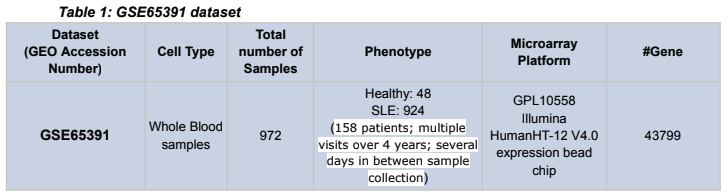

# OutPredict for SLE 

This repository is forked from [OutPredict](https://github.com/jacirrone/OutPredict) to be used for SLE data particularly from [GEO Datasets](https://www.ncbi.nlm.nih.gov/gds). Refer [OutPredict](https://github.com/jacirrone/OutPredict) for initial understanding of Gene Regulatory Networks and its usage in autoimmune diseases. 

**Paper**: Gene Expression Data and Metadata From Human Samples With Autoimmune Diseases for Machine Learning-Based Gene Regulatory Network Inference <br/>
**Authors**: Nikunj Gupta, Shengjia Chen, Jacopo Cirrone <br/>
**Affiliations**: NYU Tandon School of Engineering, NYU Langone School of Health, NYU Center for Data Science, NYU Courant Institute of Mathematical Sciences, NYU Colton Center for Autoimmune Diseases <br/>
**Correspondence**: nikunj.gupta@nyu.edu <br/> 


# Abstract 

Systemic Lupus Erythematosus (SLE) is a very complex, multi-systemic, and heterogeneous autoimmune disease that involves the production of auto-antibodies leading to chronic inflammation and organ damage, and can possibly afflict almost any organ and diverse clinical manifestations including skin rashes, arthritis and renal failure [3]. To provide detailed mechanistic insight into how dysregulation in some key human transcription factors, e.g., ELF1 and IRF1, may cause autoimmune diseases (in particular, SLE), and consequently help us identify a connection between genes expressed in antiviral defense and genes expressed in autoinflammatory disease states brought upon by the activity of these transcription factors in gene expression data from human samples with rare autoimmune diseases, building statistical models to infer accurate gene regulatory networks at important risk loci, e.g. SYNGR1, is essential. This article provides the dataset along with all the required supplementary metadata that can be used in the research involving the prediction of the causal relationships from transcription factors to genes. We also provide a bioinformatics pipeline to identify and/or generate normalized datasets, phenotypes, top differentially expressed genes, filtered genes based on their coefficient of variation, metadata (information about time series and/or steady state samples), identified human transcription factors, and top regulators for important risk loci for SLE. The presented dataset could be utilized for easy and efficient deciphering or recovering of regulatory networks from gene expression data from human samples with rare autoimmune diseases, in particular, SLE. 

# Dataset 

## Raw Data

The National Center for Biotechnology Information's (NCBI) Gene Expression Omnibus (GEO) Datasets is an international public repository that archives and freely distributes microarray, next-generation sequencing, and other forms of high-throughput functional genomics data submitted by the research community. It aims to provide a robust, versatile database for efficiently storing high-throughput functional genomic data, as well as simple submission procedures and formats that support complete and well-annotated data deposits from the research community. It provides user-friendly mechanisms for users to query, locate, review, and download studies and gene expression profiles of interest. 

## GSE65391 

For our study, we make use of the raw gene expression values available in the GSE65391 study. This dataset’s goal was to find transcriptional correlates of SLE disease activity in both cohorts and individuals. To accomplish this, the authors used microarrays to profile the whole blood transcriptomes of 158 SLE patients over a 4-year period, yielding 924 SLE samples and 48 matched pediatric healthy samples. Demographic, laboratory, and clinical information supplement the transcriptional data. There were 996 samples analyzed, with 72 being healthy controls and 924 being SLE. Table 1 shows some more details about this dataset. 

<p align="center"></p>

# Usage 

Run OutPredict for GSE65391: 

```python OP_3/pipeline_sle.py``` 

Prepare dataset for OutPredict from GEO Datasets: 

```python OP_3/GEO_datasets/create_dataset.py``` 

Perform feature selection on TFs in your dataset: 

```python OP_3/feature_selection.py``` 

Parse OutPredict's output (convert gene ids to gene symbols wherever avaiable): 

```python OP_3/output_parser.py``` 

Extract top k regulator TFs for a given target gene and / or top k regulated target genes by a given TF using Outpredict results: 

```python OP_3/top_k_regulators_and_regulated_genes.py``` 

Extract top k regulator TFs for all target gene and / or top k regulated target genes by all TFs using Outpredict results: 

```python OP_3/all_top_k_regulators_and_regulated.py``` 

